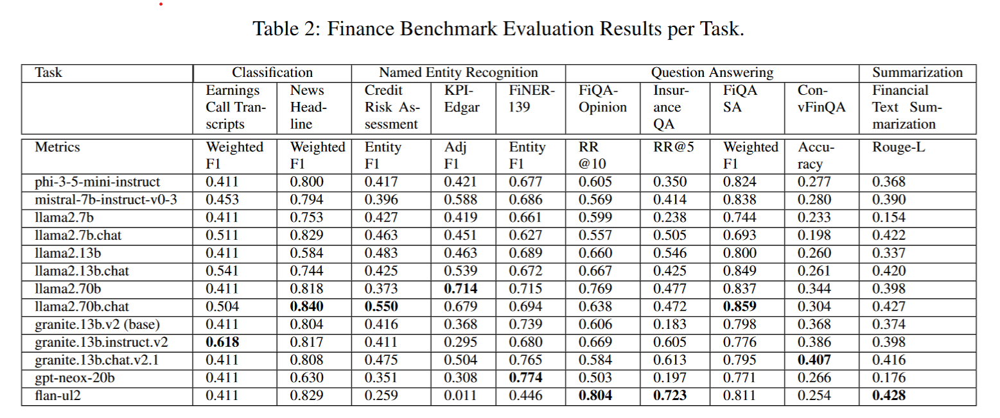
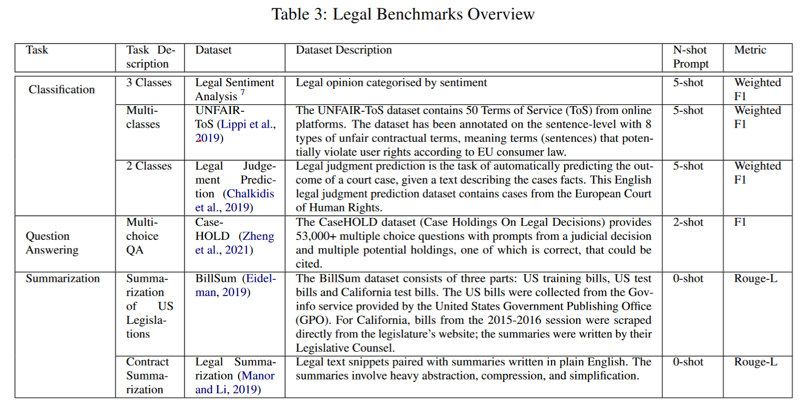
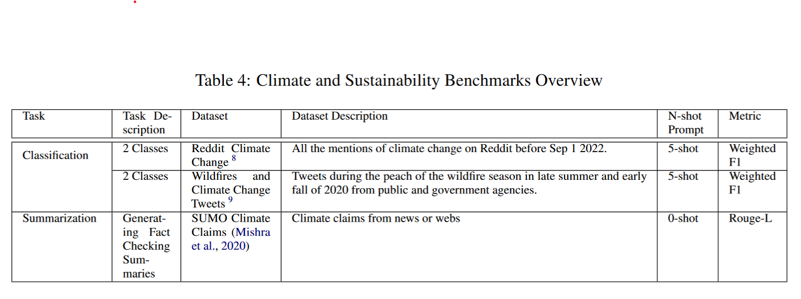
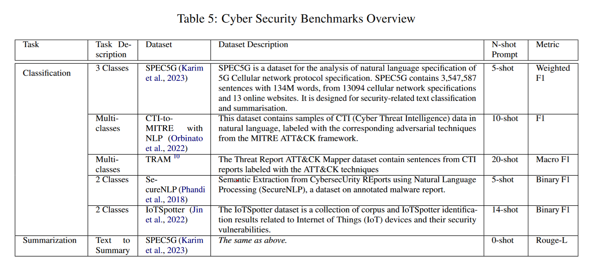

<!--intro-start-->
# Enterprise Benchmarks for Large Language Model Evaluation
This is a fork from the original HELM for a study of enterprise benchmarking of LLMs using domain-specific datasets.
The original README continues after this section.

This study is published in the following paper. Please cite this paper if you use this code in your research and you publish it.
- B. Zhang, M. Takeuchi, R. Kawahara, S. Asthana, Md. M. Hossain, G. Ren, K. Soule and Y. Zhu, “Enterprise Benchmarks for Large Language Model Evaluation.” arXiv preprint arXiv:2410.12857 2024. https://arxiv.org/abs/2410.12857

```
@misc{zhang2024enterprisebenchmarkslargelanguage,
      title={Enterprise Benchmarks for Large Language Model Evaluation}, 
      author={Bing Zhang and Mikio Takeuchi and Ryo Kawahara and Shubhi Asthana and Md. Maruf Hossain and Guang-Jie Ren and Kate Soule and Yada Zhu},
      year={2024},
      eprint={2410.12857},
      archivePrefix={arXiv},
      primaryClass={cs.CL},
      url={https://arxiv.org/abs/2410.12857}, 
}
```

- 
- 
- 
- 


The following scenarios are added. Please refer to the docstring of the source code of each scenario, or the page shown by `helm-server` for the details. The added scenarios will be contributed to HELM in future.
- Finance
    - financial_phrasebank
    - kpi_edgar
    - conv_fin_qa
    - news_headline
- Legal
    - legal_opinion
    - echr_judge
    - casehold_qa
    - legal_contract
- Climate
    - sumosum
- Cyber security
    - cti_mitre

The following metrics are added or modified.
- kpi_edgar_metrics
- classification_metrics  (weighted_f1)
- basic_metrics  (float_equiv, a bug fix for f1_score)

Contributors from IBM are as follows:
- Yada Zhu, Kate Soule (MIT-IBM Watson AI Lab)
- Mikio Takeuchi, Ryo Kawahara, Futoshi Iwama, Alisa Arno (IBM Research - Tokyo)
- Bing Zhang, Shubhi Asthana, Guang-Jie Ren (IBM Almaden Research Lab)
- Md Maruf Hossain, Naoto Satoh (former members)


# Holistic Evaluation of Language Models

[comment]: <> (When using the img tag, which allows us to specify size, src has to be a URL.)


Welcome! The **`crfm-helm`** Python package contains code used in the **Holistic Evaluation of Language Models** project ([paper](https://arxiv.org/abs/2211.09110), [website](https://crfm.stanford.edu/helm/latest/)) by [Stanford CRFM](https://crfm.stanford.edu/). This package includes the following features:

- Collection of datasets in a standard format (e.g., NaturalQuestions)
- Collection of models accessible via a unified API (e.g., GPT-3, MT-NLG, OPT, BLOOM)
- Collection of metrics beyond accuracy (efficiency, bias, toxicity, etc.)
- Collection of perturbations for evaluating robustness and fairness (e.g., typos, dialect)
- Modular framework for constructing prompts from datasets
- Proxy server for managing accounts and providing unified interface to access models
<!--intro-end-->

To get started, refer to [the documentation on Read the Docs](https://crfm-helm.readthedocs.io/) for how to install and run the package.

## Directory Structure

The directory structure for this repo is as follows

```
├── docs # MD used to generate readthedocs
│
├── scripts # Python utility scripts for HELM
│ ├── cache
│ ├── data_overlap # Calculate train test overlap
│ │ ├── common
│ │ ├── scenarios
│ │ └── test
│ ├── efficiency
│ ├── fact_completion
│ ├── offline_eval
│ └── scale
└── src
├── helm # Benchmarking Scripts for HELM
│ │
│ ├── benchmark # Main Python code for running HELM
│ │ │
│ │ └── static # Current JS (Jquery) code for rendering front-end
│ │ │
│ │ └── ...
│ │
│ ├── common # Additional Python code for running HELM
│ │
│ └── proxy # Python code for external web requests
│
└── helm-frontend # New React Front-end
```
